# SDC Protection Pipeline — Architecture Reference

## Overview

The SDC pipeline takes raw microdata through five sequential phases. Each phase has a
clear input, a defined set of decisions, and a single output that feeds the next phase.
The overall contract is: **SDC Engine finds the risk, SDC fixes the risk.**

```mermaid
flowchart TD
    A([Raw Dataset]) --> B

    subgraph PH1["Phase 1 — Classify"]
        B[Auto-detect identifiers\nname · SSN · sequential ID]
        B --> C[Score QIs\nkeyword + cardinality + uniqueness]
        C --> D[Score sensitive columns\nstructural signals + keywords]
        D --> E[Cross-column diagnostics\ngeo hierarchy · functional dependency]
        E --> F{Optional LLM\nadvisory layer}
        F --> G([Column roles confirmed\nIdentifier · QI · Sensitive · Unassigned])
    end

    G --> H

    subgraph PH2["Phase 2 — Configure"]
        H[Select protection context\nPublic · Scientific · Secure · Regulatory]
        H --> I[Set risk metric\nReID95 · k-anonymity · Uniqueness · l-Diversity]
        I --> J[Assign per-QI treatment\nHeavy · Standard · Light]
        J --> K([Targets locked\nReID target · utility floor · max suppression])
    end

    K --> L

    subgraph PH3["Phase 3 — Preprocess"]
        L[Remove direct identifiers\nmandatory]
        L --> M[Top/bottom coding\nif outlier rate > threshold]
        M --> N[Merge rare categories\nif rare-cat threshold met]
        N --> O[Type-aware pass\ndates · age · geo · skewed · high-cardinality]
        O --> P{Adaptive GENERALIZE\ntier loop}
        P -->|target not met| P
        P -->|target met or utility floor hit| Q([Preprocessed QIs\nReID reduced · cardinality lowered])
    end

    Q --> R

    subgraph PH4["Phase 4 — Protect"]
        R[Re-assess features on\npreprocessed data]
        R --> S[select_method_suite\nrule chain · first match wins]

        subgraph RULES["Rule Chain — Priority Order"]
            direction TB
            R1["Pipeline rules\nDYN · DYN_CAT · GEO1 · CAT2 · P4a/b · P5"]
            R2["Small dataset guard\nHR6 &lt;200 rows → LOCSUPR k=3"]
            R3["Structural risk\nSR3 near-unique QI"]
            R4["Risk concentration\nRC1–RC4 when var_priority available"]
            R5["Categorical / temporal / diversity\nCAT1 · LDIV1+DATE1 merged · DP4"]
            R6["ReID pattern rules\nQR0–QR4 · MED1 · MED1-high-supp"]
            R7["Low-risk rules\nLOW1–LOW3 when ReID95 ≤20%"]
            R8["Distribution rules\nDP1–DP3 outliers · skew · sensitive"]
            R9["Uniqueness fallback\nHR1–HR5 when no ReID available"]
            R10["Defaults\nmicrodata · categorical · continuous · emergency"]
            R1 --> R2 --> R3 --> R4 --> R5 --> R6 --> R7 --> R8 --> R9 --> R10
        end

        S --> RULES
        RULES -->|first match| MF{Metric–Method Filter\nmethod allowed for\nuser's chosen metric?}
        MF -->|blocked| RULES
        MF -->|allowed| T[Smart config\nper-method pre-estimation\nsuppression · dominance · IQR]
        T --> U[Treatment balance\napply Heavy/Light adjustments\nto selected params]
        U --> FF[Filter fallbacks\nstrip blocked methods from\nfallback + pipeline lists]
        FF --> V{Retry engine}

        subgraph RETRY["Retry Loop — run_rules_engine_protection"]
            direction TB
            V1["Step 1 — Pipeline\nrun sequential methods\nmid-check skips PRAM/NOISE steps"]
            V2["Step 1b — GENERALIZE_FIRST\nif QR0 infeasible\nrestore snapshot · generalize · re-select"]
            V3["Step 2 — Primary + Escalation\nsmart start · k-pruning\nover-suppression guard · plateau detect"]
            V4["Step 3 — Fallbacks (filtered)\nbidirectional cross-method start\nper-QI injection · up to 5 fallbacks"]
            V5["Step 4 — Feasibility advisory\nensure_feasibility · suggest QI removal"]
            V1 -->|targets met| DONE1([Done])
            V1 -->|pipeline failed| V2
            V2 --> V3
            V3 -->|targets met| DONE2([Done])
            V3 -->|failed| V4
            V4 -->|targets met| DONE3([Done])
            V4 -->|all failed| V5
        end

        V --> RETRY
        RETRY --> W([Protected dataset])
    end

    W --> X

    subgraph PH5["Phase 5 — Verify"]
        X[Utility score\nPearson + row-match on sensitive cols]
        X --> Y[Granularity\nunique values before vs after per QI]
        Y --> Z[Relationship check\ncross-tab group-mean correlation]
        Z --> AA[Post-protection diagnostics\nper-QI utility · l-diversity · method quality\ntreatment alignment · timing · failure guidance]
        AA --> AB([Results + diagnostics surfaced in UI])
    end

    AB --> AC([Export protected dataset])
```



> **Flowchart note:** The `MF -->|blocked| RULES` arrow represents "continue to the next
> rule in priority order," not "restart from R1." The rule chain is evaluated top-down;
> a blocked match skips that rule and the loop resumes from the next candidate.

---

## Phase 1 — Classify

Columns are assigned roles in a fixed pass: **Identifiers → QIs → Sensitive → Unassigned**.
Each column is assigned only once. Near-constant columns (one value ≥95% of records)
are pre-classified as Unassigned before the pass begins.

**Identifier detection** uses name patterns (SSN, ΑΦΜ, ΑΜΚΑ, email, phone), near-unique
strings (>95% unique), and sequential integers. Greek-specific identifiers are detected
separately.

**QI scoring** fuses two signals. Before SDC Engine runs: keyword/pattern scoring weighted
20% name + 40% type/cardinality + 40% uniqueness contribution. After SDC Engine: the keyword
score is down-weighted to 30% and risk contribution (from backward elimination) takes 70%.
Domain boosters (+0.15 for date/geographic, +0.10 for demographic) push borderline columns
over the QI threshold. DEFINITE-tier keywords always produce a QI regardless of risk score.

**Sensitive detection** uses structural signals as primary — continuous numerics with low
risk contribution, high entropy, skewed distributions, ratio/percentage patterns — and
keyword matches as a bonus. Dual-role warnings flag columns that score both as sensitive
and as potential QIs.

**Cross-column diagnostics** detect geographic hierarchies (fine-grained QI nesting within
coarse), functional dependencies (A determines B), and near-redundant sensitive columns.
When a hierarchy is detected, the finer-grained QI is auto-set to Unassigned with the user
able to override.

An optional LLM advisory layer adds cross-column reasoning and domain-aware suggestions
on top of the rule-based results. The user confirms the final classification.

---

## Phase 2 — Configure

**Protection context** maps to a target set:

| Context | ReID95 target | k target | l target | Utility floor | Max suppression |
|---|---|---|---|---|---|
| Public release | ≤1% | ≥10 | ≥3 | 85% | 10% |
| Scientific use | ≤5% | ≥5 | ≥2 | 90% | 15% |
| Secure environment | ≤10% | ≥3 | ≥2 | 92% | 20% |
| Regulatory compliance | ≤3% | ≥5 | ≥3 | 88% | 12% |

> **Note:** The Streamlit UI (`streamlit_app/pages/2_Configure.py`) exposes only three
> contexts: Public Release, Scientific Use, and Secure Environment. Regulatory Compliance
> is available programmatically via `config.py` but is not shown in the UI.

**Risk metric selection** — the user selects one of four metrics as the optimisation
target. All are normalised to a 0→1 risk score so the rules engine operates identically
regardless of which metric the user selects.

| Metric | Normalization | Example: raw → score |
|---|---|---|
| ReID95 | passthrough | 0.05 → 0.05 |
| k-Anonymity | 1/k | k=5 → 0.20 |
| Uniqueness | passthrough | 0.05 → 0.05 |
| l-Diversity | 1/l | l=2 → 0.50 |

l-Diversity requires sensitive columns to be assigned (it measures distinct sensitive
values within equivalence classes). If no sensitive columns exist when l-diversity is
selected, the UI shows a warning and disables the Calculate button.

The chosen metric also constrains which protection methods are available — see
**Metric–Method Filter** in Phase 4.

**Per-QI treatment levels** are auto-filled from classification priority (HIGH → Heavy,
MODERATE → Standard, LOW → Light) and flow through the entire pipeline: preprocessing
parameters, protection method parameters, and method selection adjustments.

---

## Phase 3 — Preprocess

Five ordered steps, each conditional except the first:

1. **Remove direct identifiers** — always runs, cannot be skipped.
2. **Top/bottom coding** — runs only if the outlier rate assessment flags numeric QIs with
   extreme tails. Clips at p2/p98 percentiles, scaled by treatment level.
3. **Merge rare categories** — runs if any categorical QI has categories below the
   min-frequency threshold. Threshold scales with treatment level.
4. **Type-aware pass** — one-time routing: dates → date truncation, age-like numerics →
   5-year binning, geographic → coarsening or top-K grouping, skewed → top/bottom coding,
   high-cardinality numeric → quantile binning, high-cardinality categorical → top-K.
   Every cardinality decision is context-aware — it accounts for the combined product of
   all other QIs so the combination space stays feasible for k=5.
5. **Adaptive GENERALIZE tier loop** — runs escalating tiers (light → moderate → aggressive
   → very aggressive) until the risk target is met or the utility floor is hit. Each tier
   starts fresh from the type-preprocessed data (no compounding). Structural Risk above 50%
   skips straight to aggressive tier.

If >8 QIs are detected, the system recommends dropping the least important ones to reach 7,
never recommending QIs with Heavy treatment.

---

## Phase 4 — Protect

### Rule Chain

After preprocessing, features are re-assessed on the reduced data. `select_method_suite()`
evaluates rules in strict priority order — **first match wins**:

| Priority | Group | Rules | Trigger |
|---|---|---|---|
| 1 | **Pipelines** | DYN, DYN_CAT, GEO1, CAT2, P4a, P4b, P5 | Multi-method needed; checked before all single-method rules |
| 2 | **Small dataset** | HR6 | <200 rows — structural constraint |
| 3 | **Near-unique** | SR3 | ≤2 QIs + max uniqueness >70% |
| 4 | **Risk concentration** | RC1–RC4 | var_priority available + ReID95 >15% |
| 5 | **Type/diversity** | CAT1, LDIV1+DATE1, DP4 | Categorical dominant, l-diversity gap, temporal dominant, integer-coded |
| 6 | **ReID pattern** | QR0–QR4, MED1, MED1-high-supp | Risk distribution shape drives k/p |
| 7 | **Low risk** | LOW1–LOW3 | ReID95 ≤20%, type-based |
| 8 | **Distribution** | DP1–DP3 | Outliers, skewness, sensitive attributes |
| 9 | **Uniqueness fallback** | HR1–HR5 | No ReID available |
| 10 | **Default** | DEFAULT, EMERGENCY | Nothing else matched |

**Key decision boundary:** ReID95 >5% → structural method required (kANON or LOCSUPR).
ReID95 ≤5% → perturbation may suffice (PRAM, NOISE). Perturbation methods cannot reduce
equivalence-class-based risk.

### Metric–Method Filter

The rule chain is risk-level-aware but metric-agnostic — it selects methods based on data
features, not the user's chosen metric. A post-rule filter ensures the recommended method
can actually optimise the chosen target.

| Metric | Allowed methods | Blocked methods |
|---|---|---|
| ReID95 | kANON, LOCSUPR, PRAM, NOISE | None |
| k-Anonymity | kANON, LOCSUPR | PRAM, NOISE |
| Uniqueness | kANON, LOCSUPR | PRAM, NOISE |
| l-Diversity | kANON, LOCSUPR, PRAM | NOISE |

**Rationale:**

- k-Anonymity and Uniqueness require structural changes to equivalence classes.
  Perturbation methods (PRAM, NOISE) shuffle or add noise to values
  without guaranteeing group-size properties.
- l-Diversity requires diverse sensitive values within equivalence classes. PRAM on
  sensitive columns can increase within-class diversity, so it is allowed. NOISE on QIs
  does not affect sensitive-value composition within classes.
- ReID95 has no restrictions — all methods can reduce per-record re-identification
  probability.

**Filter logic** (in `select_method_suite()`):

1. Rule chain fires first match as normal.
2. Post-match check: is the recommended method in the allowed set for the active metric?
3. If blocked:
   - **Pipeline rule** — if ANY step in the pipeline is blocked, skip the entire pipeline
     (partial pipelines are fragile). Fall through to the next rule.
   - **Single-method rule** — skip the rule, continue to the next match.
4. Fallback lists (`reid_fallback`, `utility_fallback`, per-method fallbacks) are also
   filtered through the allowed set before the retry engine starts.
5. Emergency fallback is kANON(k=5), which is in the allowed set for all metrics —
   the chain always produces a result.

**LDIV1 rule gate:** When the active metric is k-anonymity or uniqueness, the LDIV1 rule
(which recommends PRAM on sensitive columns for l-diversity concerns) does not fire. It
is only relevant when the user has explicitly selected l-diversity or ReID95 as target.

**Suppression clamping:** All kANON rules marked `†` (RC2, RC3, QR2–QR4, MED1, HR2, HR3)
call `_clamp_k_by_suppression()` before committing to a k value — reducing k if estimated
suppression at that k would exceed 30%.

### Pipeline Selection

The dynamic builder assembles pipelines from data features rather than matching hardcoded
patterns:

1. **Categorical guard** — ≥70% categorical: defer to CAT1 (PRAM). 50–70% categorical
   with ≥1 continuous: build DYN_CAT (NOISE → PRAM, optional LOCSUPR tail).
2. **GEO1** — 2+ geographic QIs with both fine-grained and coarse levels:
   GENERALIZE (fine geos) → kANON.
3. **kANON step** — added when ReID95 >20% (k=7 if >40%, else k=5, strategy=hybrid).
4. **NOISE step** — added when continuous QIs have outliers AND kANON not already selected
   (kANON and NOISE are mutually exclusive in the builder).
5. **LOCSUPR tail** — added when kANON is absent and high_risk_rate >15% (k=3); or when
   kANON is present but high_risk_rate >30% and estimated suppression at k=7 <40% (k=7).

Legacy pipelines (CAT2, P4a, P4b, P5) cover edge cases not handled by the dynamic builder.

**Treatment balance** is applied to both single-method and pipeline output before the retry
engine starts. ≥60% Heavy bumps k +2 (or p/magnitude +0.05). ≥60% Light reduces k -1
(or p -0.05, magnitude -0.03).

### Retry Engine

```
0. Feasibility diagnosis — diagnose_qis() computes max_achievable_k
   All k escalation values above max_achievable_k are pruned.

0b. Metric filter — strip blocked methods from suite
    Fallback lists, pipeline steps, and cross-method starting points
    are filtered through METRIC_ALLOWED_METHODS before any attempts.

1. Pipeline — run sequential methods
   Mid-pipeline risk check after each structural step (skipped after PRAM/NOISE —
   perturbative steps cannot move ReID so the check is always a no-op).
   If targets met → done.

1b. GENERALIZE_FIRST — only if QR0 fired (infeasible)
    Restore pre-pipeline snapshot (clean original data).
    Apply aggressive generalization (max_categories=5).
    Rebuild features. Re-select method.
    If still infeasible → LOCSUPR k=3.

2. Primary + Escalation
   Smart start: skip early schedule values based on ReID gap.
   k-pruning: remove schedule values above max_achievable_k.
   Guards: over-suppression (any QI >40% suppressed → fallbacks),
           plateau detection (no improvement after N steps → stop),
           time budget (30s max), utility floor.

3. Fallbacks — up to 5 methods (filtered by metric)
   Bidirectional cross-method start params (structural→perturbative and reverse).
   Per-QI parameter injection at each attempt.
   Perturbation methods (PRAM/NOISE) filtered out if ReID gap is far above target
   OR if the active metric blocks them (k-anonymity, uniqueness).

4. Feasibility advisory — ensure_feasibility()
   Identifies bottleneck QI, suggests removal. Advisory only — user confirms.
```

**Escalation schedules:**

| Method | Parameter | Schedule |
|---|---|---|
| kANON | k | 3 → 5 → 7 → 10 → 15 → 20 → 25 → 30 |
| LOCSUPR | k | 3 → 5 → 7 → 10 → 15 → 20 |
| PRAM | p_change | 0.10 → 0.15 → 0.20 → 0.25 → 0.30 → 0.35 → 0.40 → 0.50 |
| NOISE | magnitude | 0.05 → 0.10 → 0.15 → 0.20 → 0.25 |

**Cross-method starting points:**

| Primary failed at | PRAM starts at | NOISE starts at | LOCSUPR starts at |
|---|---|---|---|
| kANON k=3 | p=0.10 | mag=0.05 | k=3 |
| kANON k=5 | p=0.15 | mag=0.10 | k=5 |
| kANON k=7–10 | p=0.20 | mag=0.15 | k=7 |
| kANON k=15+ | p=0.25 | mag=0.20 | k=10 |

Perturbative → structural uses the current ReID gap: ≤5% → k=3, ≤15% → k=5,
≤30% → k=7, >30% → k=10.

---

## Phase 5 — Verify

Three independent metrics (never blended into one score):

**Utility score** — Pearson correlation (numeric) + row-match rate (categorical) computed
on sensitive columns. If sensitive columns are untouched (utility ≥0.95), the engine also
checks QI per-variable utility average to catch QI destruction.

**Granularity** — unique values before vs after per QI. Shows how much resolution was lost.

**Relationship check** — computed only when records are suppressed or sensitive values
perturbed (pure binning always scores ~100% and is skipped). Groups both datasets by QI
bins, correlates group means. Warning if mean subgroup preservation <60%.

**Post-protection diagnostics** (collapsible in UI):

| Diagnostic | Content |
|---|---|
| Per-QI utility | Preprocessing vs protection utility per QI, delta, verdict |
| l-diversity | Distinct sensitive values per equivalence class, violation count. Also used as the accept/reject gate when l-diversity is the active target metric |
| Method quality | Suppression rate, dominant QI, correlation preservation |
| Treatment alignment | Did Heavy QIs get heavier treatment than Light QIs? |
| Timing | Per-phase: pipeline, primary escalation, fallbacks, total |
| Failure guidance | Bottleneck QI, per-method failure reasons, remediation suggestions |

---

## Implementation: Metric–Method Filter (Phase 1) ✓ Implemented

Post-rule filtering in `select_method_suite()` ensures incompatible methods are never
recommended when the user's chosen metric cannot be optimised by those methods.

### Files to modify

**1. `sdc_engine/sdc/config.py`**

Add constant and helpers:

```python
METRIC_ALLOWED_METHODS: Dict[str, List[str]] = {
    'reid95':       ['kANON', 'LOCSUPR', 'PRAM', 'NOISE'],
    'k_anonymity': ['kANON', 'LOCSUPR'],
    'uniqueness':  ['kANON', 'LOCSUPR'],
    'l_diversity': ['kANON', 'LOCSUPR', 'PRAM'],
}

def is_method_allowed_for_metric(method: str, risk_metric: str) -> bool:
    allowed = METRIC_ALLOWED_METHODS.get(risk_metric)
    if allowed is None:
        return True
    return method in allowed

def filter_methods_for_metric(methods: List[str], risk_metric: str) -> List[str]:
    allowed = METRIC_ALLOWED_METHODS.get(risk_metric)
    if allowed is None:
        return methods
    return [m for m in methods if m in allowed]
```

**2. `sdc_engine/sdc/selection/rules.py` — `l_diversity_rules()`**

Add metric gate at top:

```python
risk_metric = features.get('_risk_metric_type', 'reid95')
if risk_metric in ('k_anonymity', 'uniqueness'):
    return {'applies': False}
```

**3. `sdc_engine/sdc/selection/pipelines.py` — `select_method_suite()`**

Read metric from features:

```python
risk_metric = features.get('_risk_metric_type', 'reid95')
```

A. Pipeline rules filter — after `pipeline_result` matches, check each method in
the pipeline list. If ANY is blocked, skip the entire pipeline (don't return,
fall through to single-method rules).

B. Single-method rule loop — after `rule.get('applies')` is True:
- If `rule.get('use_pipeline')`: check all pipeline methods — if any blocked, `continue`
- Else: check `rule['method']` — if blocked, `continue`
- Filter `fallbacks`, `reid_fallback`, `utility_fallback` through the allowed set

C. Emergency fallback — kANON(k=5), always in the allowed set for all metrics.

**4. `sdc_engine/sdc/protection_engine.py` — `run_rules_engine_protection()`**

After receiving `suite` from `select_method_suite()`, filter the fallback chain:

```python
from sdc_engine.sdc.config import is_method_allowed_for_metric, filter_methods_for_metric

_risk_metric = data_features.get('_risk_metric_type', 'reid95')

# suite['fallbacks'] is List[Tuple[str, dict]] — filter by method name
suite['fallbacks'] = [
    (m, p) for m, p in suite.get('fallbacks', [])
    if is_method_allowed_for_metric(m, _risk_metric)
]
# Nullify blocked reid/utility fallbacks
for _fb_key in ('reid_fallback', 'utility_fallback'):
    _fb = suite.get(_fb_key)
    if _fb and not is_method_allowed_for_metric(_fb['method'], _risk_metric):
        suite[_fb_key] = None
```

Also filter `METHOD_FALLBACK_ORDER` usage within the retry loop — anywhere
`get_method_fallbacks()` is called, wrap with `filter_methods_for_metric()`.

### Implementation order

1. Add `METRIC_ALLOWED_METHODS` + helpers to `config.py`
2. Add metric gate to `l_diversity_rules()` in `rules.py`
3. Add filtering logic to `select_method_suite()` in `pipelines.py`
4. Add fallback filtering to `run_rules_engine_protection()` in `protection_engine.py`

### Edge cases

- If filtering exhausts all rules, the emergency fallback kANON(k=5) always fires.
- If filtering removes all fallbacks, the retry engine runs primary + escalation only
  (no fallback phase). The primary is guaranteed to be in the allowed set.
- Pipelines are skipped whole, never partially filtered. A kANON→PRAM pipeline under
  k-anonymity metric is skipped; the chain falls through to a pure kANON rule.

---

## Implementation: l-Diversity as Selectable Target (Phase 2) ✓ Implemented

l-diversity is now a first-class optimisation target in `RiskMetricType`. The UI, config
defaults, and `get_l_target()` / `get_t_target()` already existed. Phase 2 added the enum,
normalization (1/l), `compute_risk()` L_DIVERSITY branch with `sensitive_columns` kwarg,
and removed the `get_risk_metric_type()` fallback that mapped l-diversity back to reid95.
Depends on Phase 1 (metric–method filter table).

### New enum value

```python
class RiskMetricType(Enum):
    REID95 = 'reid95'
    K_ANONYMITY = 'k_anonymity'
    UNIQUENESS = 'uniqueness'
    L_DIVERSITY = 'l_diversity'
```

### Normalization

```
l-Diversity → 1/l  (l=1 → 1.0, l=2 → 0.50, l=5 → 0.20)
```

Same pattern as k-anonymity. Target l=2 normalises to 0.50. The rule chain sees a high
normalised score and picks structural methods, which is correct.

### Files to modify

**1. `sdc_engine/sdc/metrics/risk_metric.py`**

A. Add `L_DIVERSITY = 'l_diversity'` to `RiskMetricType`.

B. Add to `_LABELS`: `RiskMetricType.L_DIVERSITY: 'l-Diversity'`.

C. Add to `_DEFAULT_TARGETS`: `RiskMetricType.L_DIVERSITY: 2`.

D. Extend `normalize_to_risk_score()`:

```python
elif metric_type == RiskMetricType.L_DIVERSITY:
    l = max(raw_value, 1)
    return float(np.clip(1.0 / l, 0, 1))
```

E. Extend `normalize_target()`:

```python
elif metric_type == RiskMetricType.L_DIVERSITY:
    return float(1.0 / max(target_raw, 1))
```

F. Add display methods to `RiskAssessment`:

```python
# display_value:
elif self.metric_type == RiskMetricType.L_DIVERSITY:
    return f'l = {int(self.raw_value)}'

# display_target:
elif self.metric_type == RiskMetricType.L_DIVERSITY:
    return f'l ≥ {int(self.target_raw)}'

# display_value_short:
elif self.metric_type == RiskMetricType.L_DIVERSITY:
    return f'l={int(self.raw_value)}'
```

G. Extend `compute_risk()` — add `sensitive_columns` as keyword-only parameter
(the `*` barrier ensures no existing positional call sites break):

```python
def compute_risk(
    data: pd.DataFrame,
    quasi_identifiers: List[str],
    metric_type: RiskMetricType = RiskMetricType.REID95,
    target_raw: Optional[float] = None,
    *,                                                   # keyword-only barrier
    sensitive_columns: Optional[List[str]] = None,       # NEW
) -> RiskAssessment:
```

Add `L_DIVERSITY` branch — use `size_threshold=200` (higher than diagnostic default of
50) when used as gate metric:

```python
elif metric_type == RiskMetricType.L_DIVERSITY:
    from ..post_protection_diagnostics import check_l_diversity
    l_result = check_l_diversity(
        data, quasi_identifiers,
        sensitive_columns or [], l_target=int(target_raw or 2),
        size_threshold=200)
    raw = float(l_result.get('l_achieved') or 1)
    details = l_result
```

If no `sensitive_columns` provided, `check_l_diversity` returns `l_achieved=None`,
mapped to `raw=1` (maximum risk score 1/1 = 1.0). The UI already requires sensitive
columns for this metric via the existing Configure flow.

H. `risk_to_reid_compat()` — no change needed. L_DIVERSITY falls through to the existing
`else` branch which produces a synthetic dict from `normalized_score`. The `_synthetic`
and `_source_metric` fields are already set.

I. Extend `get_metric_display_info()`:

```python
elif mt == RiskMetricType.L_DIVERSITY:
    target_display = f'l ≥ {int(target_raw)}'
    card_label = f'l-Diversity (target: l ≥ {int(target_raw)})'
```

**2. `sdc_engine/sdc/config.py`**

A. Add `'l_diversity'` entry to `METRIC_ALLOWED_METHODS` (already specified in Phase 1):

```python
METRIC_ALLOWED_METHODS['l_diversity'] = ['kANON', 'LOCSUPR', 'PRAM']
```

PRAM allowed — perturbation of sensitive values increases within-class diversity.
NOISE blocked — noise on QIs does not affect sensitive-value composition.

B. No changes to `get_context_targets()` — l-diversity per-context defaults already
exist in `PROTECTION_THRESHOLDS` and are retrieved via `get_l_target()`.

**3. `sdc_engine/sdc/protection_engine.py`**

A. Thread `sensitive_columns` through `build_data_features()` — add as keyword-only
param and forward to `compute_risk()`:

```python
def build_data_features(
    data, quasi_identifiers, ...,
    *,
    sensitive_columns: Optional[List[str]] = None,
) -> Dict:
    ...
    assessment = compute_risk(data, quasi_identifiers, mt, risk_target_raw,
                              sensitive_columns=sensitive_columns)
```

Also store in returned features dict:
`features['sensitive_columns'] = sensitive_columns or []` — needed by rules that check
sensitive column properties.

B. Update all call sites of `build_data_features()`:

- Initial call (~line 890): pass `sensitive_columns=sensitive_columns`
- GENERALIZE_FIRST rebuild (~line 1091): pass `sensitive_columns=sensitive_columns`

C. `run_rules_engine_protection()` — already accepts `sensitive_columns`. Forward it to
`compute_risk()` calls in the retry loop when metric is l-diversity. No change to
`_meets_targets()` — it reads `reid_after['reid_95']` which is populated by
`risk_to_reid_compat()` with the normalised l-diversity score.

D. `run_pipeline()` — same: pass `sensitive_columns` to mid-pipeline `compute_risk()`
calls when metric is l-diversity.

**4. `streamlit_app/pages/2_Configure.py`** *(active Streamlit UI)*

> The archived Panel UI (`sdc_engine/views/sdc_configure.py`) contained equivalent
> `get_risk_metric_type()` logic but is no longer used.

A. Remove the reid95 fallback for l-diversity from `get_risk_metric_type()`:

```python
def get_risk_metric_type(self) -> str:
    rm = self.risk_metric_selector.value
    if rm in ('reid95', 'k_anonymity', 'uniqueness', 'l_diversity'):
        return rm
    return 'reid95'  # t_closeness still falls back (Phase 3)
```

No other UI changes needed — the metric selector, l-target widget, and sensitive-column
gate already exist.

### Accept/reject path

The retry loop's `_meets_targets()` checks:

```python
reid = result.reid_after.get('reid_95', 1)
return reid <= reid_target
```

This works unchanged. `reid_after` is set by `risk_to_reid_compat()`, which maps the
normalised l-diversity score (1/l) into `reid_95`. The target is also normalised via
`normalize_target()`. So `_meets_targets()` compares `1/l_achieved <= 1/l_target`,
which is equivalent to `l_achieved >= l_target`.

### Implementation order

1. `risk_metric.py` — enum, normalization, compute_risk, display methods
2. `config.py` — add `l_diversity` to `METRIC_ALLOWED_METHODS`
3. `protection_engine.py` — thread `sensitive_columns` through `build_data_features`
4. `streamlit_app/pages/2_Configure.py` — remove l_diversity from reid95 fallback
5. `user_guide.md` — update docs

### Known limitations

- `check_l_diversity()` skips equivalence classes larger than `size_threshold` (raised to
  200 for gate use, default 50 for diagnostics). For high l targets (≥5) this could miss
  violations in large classes. Documented in user guide.
- l-diversity requires sensitive columns to be meaningful. If none configured,
  `compute_risk()` returns l=1 (maximum risk score). The UI already requires sensitive
  columns for this metric via the existing Configure flow.

### Dependencies

- Phase 2 depends on Phase 1 (the `METRIC_ALLOWED_METHODS` table must include
  `l_diversity` before the metric is selectable).
- Phase 1 is standalone and can be implemented first.

---

## Future: t-Closeness as Selectable Target (Phase 3)

t-Closeness is already in the Configure UI metric selector and has per-context defaults,
but `get_risk_metric_type()` falls it back to reid95. Promoting it to `RiskMetricType`
requires new computation — Earth Mover's Distance (numeric) or variational distance
(categorical) per equivalence class against the global distribution. No existing function
covers this. Deferred until there is a concrete use case or user request.

---

## Known Limitation

**Pre-preprocessing structural risk** is not used as a signal in Phase 4 method selection.
The protection engine assesses features on the post-preprocessing snapshot only. A dataset
that entered preprocessing at SR=80% and exited at SR=12% is treated identically to one
that was always SR=12%. The retry loop compensates for mismatches, but first-method
selection may be suboptimal in some cases. Flagged for future improvement pending
empirical evidence of measurable escalation waste.

---

*Based on user guide appendix v3 and implementation review. All 10 architecture issues
identified in the review have been resolved except the pre-preprocessing structural risk
signal (consciously deferred). Metric–method filter (Phase 1) and l-diversity target
promotion (Phase 2) are implemented.*
