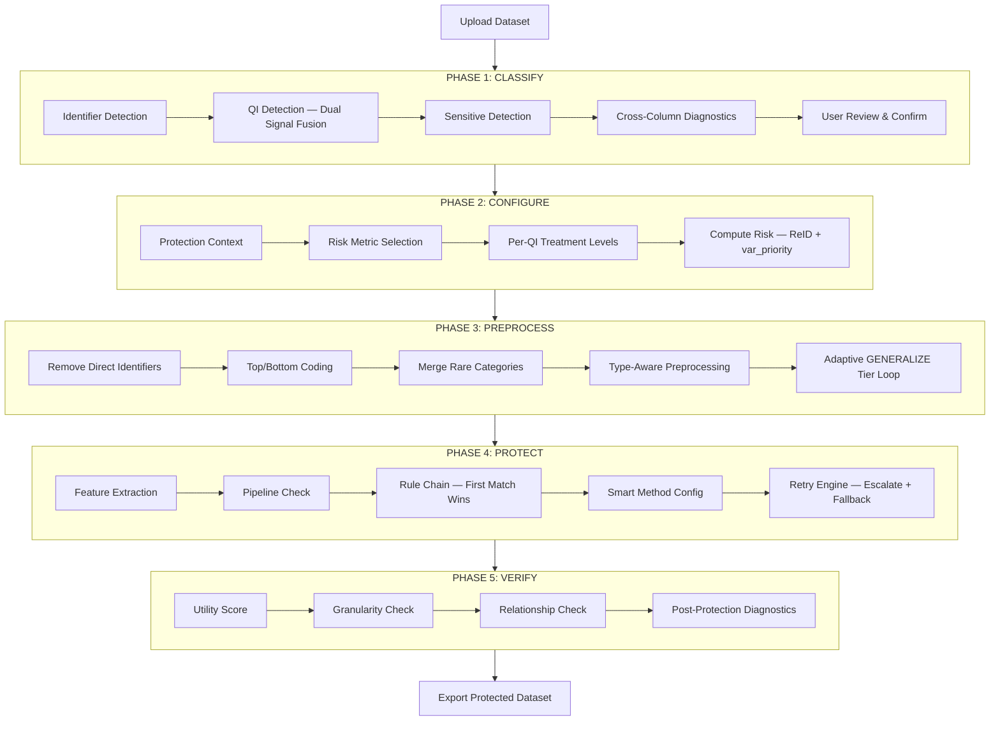
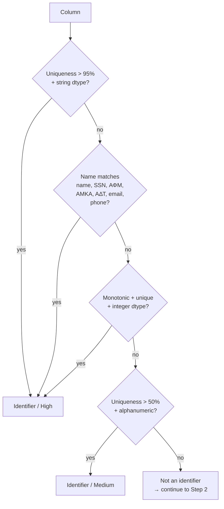
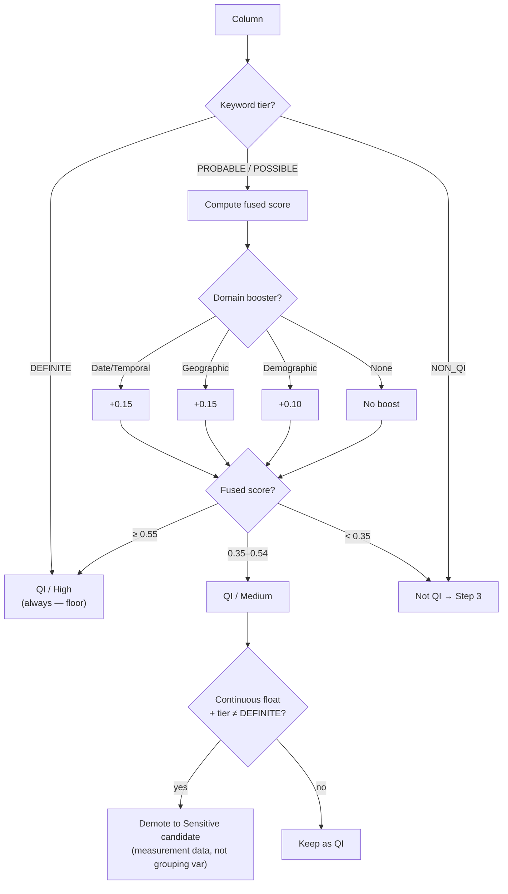
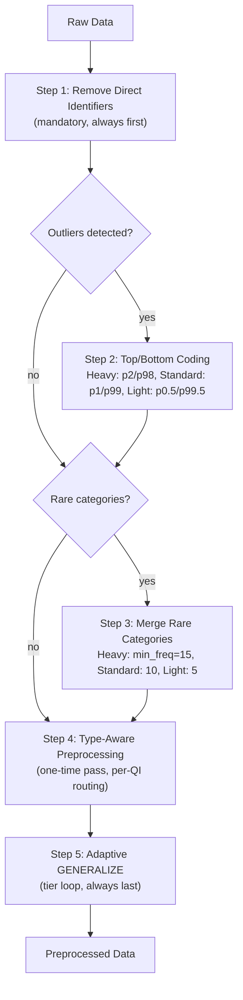
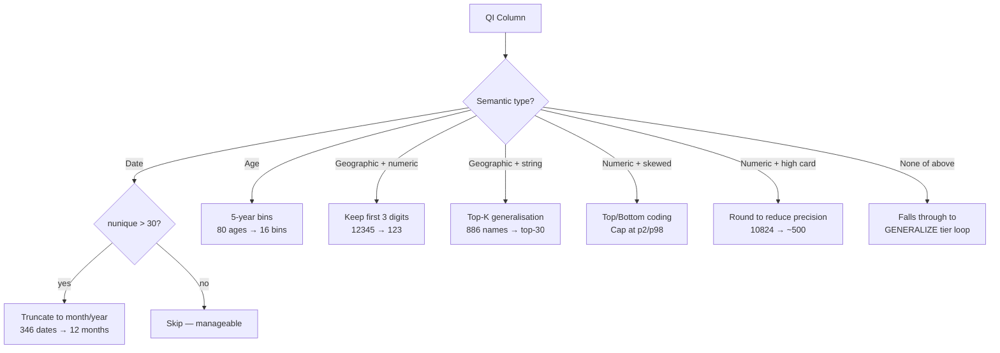
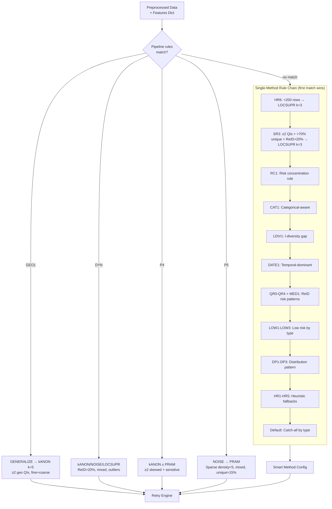
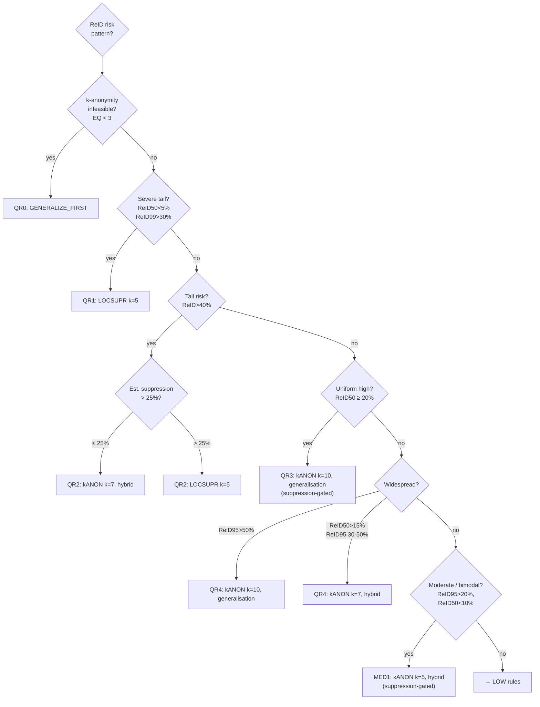
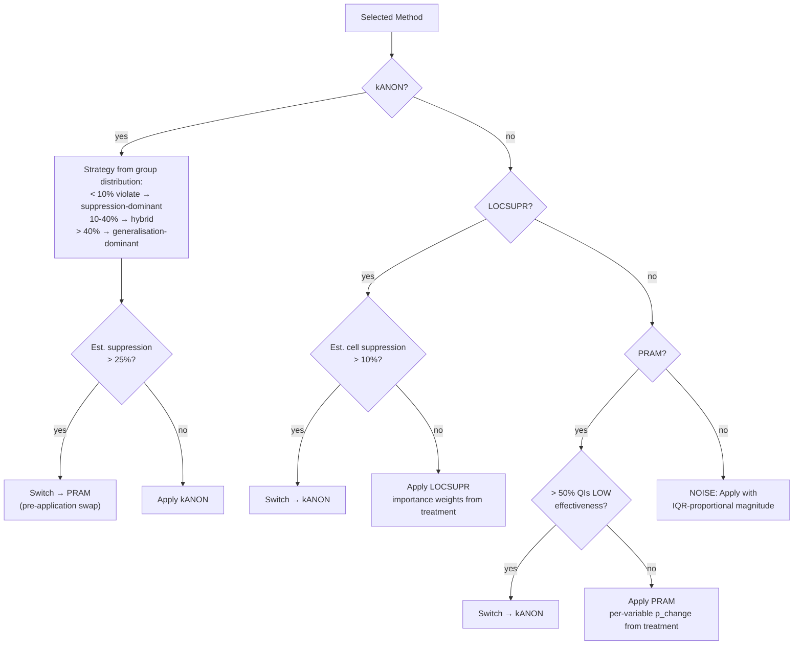
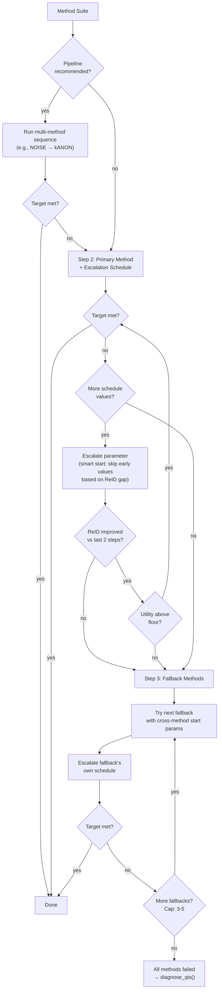

# SDC Engine — Smart Rules Reference

Complete specification of every rule, threshold, and decision point across the five-phase SDC pipeline.

---

## Pipeline Overview



---

## Phase 1: Classification

### Processing Order

Fixed pass: **Identifiers → QIs → Sensitive → Unassigned**. Each column is assigned exactly once — earlier passes exclude columns from later ones.

**Pre-classification:** Near-constant columns (one value ≥ 95% of records) → Unassigned immediately.

### Step 1: Identifier Detection



Sources: `auto_detect_direct_identifiers()` + `detect_greek_identifiers()`.

Greek-specific patterns: ΑΦΜ (tax number, 9 digits), ΑΜΚΑ (social security, 11 digits), ΑΔΤ (ID card).

### Step 2: QI Detection — Dual-Signal Fusion

Two independent signals are computed, then fused.

**Signal A — Keyword/Pattern Scoring** (`qi_detection.py`)

Weighted: 20% name_based + 40% type_based + 40% uniqueness.

| Keyword Tier | Score Range | Examples | Result |
|---|---|---|---|
| DEFINITE | ≥ 0.90 | age, gender, zipcode, birthdate, ηλικία, φύλο | → QI / High (floor — always QI regardless of risk) |
| PROBABLE | 0.60–0.89 | income, diagnosis, religion, employer, εισόδημα | → QI / Medium |
| POSSIBLE | 0.30–0.59 | type, category, group, status | → Not QI |
| NON_QI | < 0.30 | — | → Not QI |

**Signal B — Risk Contribution** (from backward elimination `var_priority`)

Per-column contribution percentage from leave-one-out risk analysis.

**Fusion formula:**

```
IF keyword_tier == DEFINITE:
    → QI / High  (always, regardless of risk contribution)
ELSE:
    fused = 0.30 × keyword_confidence + 0.70 × risk_contribution_normalized
    
    Domain boosters (additive, capped at 1.0):
        Date/temporal column  → +0.15
        Geographic column     → +0.15
        Demographic column    → +0.10
    
    Thresholds:
        fused ≥ 0.55  → QI / High
        fused 0.35–0.54 → QI / Medium
        fused < 0.35  → Not QI
```



**Non-integer numeric guard:** Continuous float columns (prices, areas, amounts) are demoted from QI to Sensitive candidate, unless keyword tier is DEFINITE. Rationale: measurement data has low re-identification value as a grouping variable.

### Step 3: Sensitive Detection

Structural signals are primary (column names may be arbitrary or Greek).

**Positive signals (increase sensitive score):**

| Signal | Score | Condition |
|---|---|---|
| Continuous numeric + low risk | +0.25 to +0.40 | Smooth ramp: rc=0% → +0.40, rc=10% → +0.25, rc≥15% → 0 |
| High entropy (> 4 bits) | +0.25 | Many distinct values — likely measurement data |
| Skewed distribution (skew > 2) | +0.15 | Right-skewed numerics: income, prices, areas |
| Moderate cardinality numeric (20–500) + low risk | +0.20 | Too many for categorical QI, too few for ID |
| Binary/few categories + low risk | +0.15 to +0.20 | Outcome/flag variable |
| Ratio/percentage pattern (0–1 or 0–100 range) | +0.25 | Value structure detection |
| Value keyword match (income, τιμή, diagnosis, etc.) | +0.20 | Name-based bonus |

**Negative signals (decrease sensitive score):**

| Signal | Score | Condition |
|---|---|---|
| High cardinality non-numeric (> 50% unique) | −0.30 | Likely hidden identifier |
| Administrative keyword (code, type, κωδικός) | −0.15 | Not analytical |
| High risk contribution (> 10%) + non-continuous | −0.20 | May be uncaught QI |
| Low-cardinality numeric (< 20) + not count pattern | −0.15 | More like a classifier |

**Thresholds:** sensitive_score ≥ 0.50 → Sensitive / High confidence; ≥ 0.35 → Sensitive / Medium; ≥ 0.20 → Sensitive / Low. Below 0.20 → Unassigned.

### Step 4: Cross-Column Diagnostics

| Check | Condition | Action |
|---|---|---|
| Geographic hierarchy | Fine-grained QI nests within coarse QI (≥ 90% nesting) | Auto-drop finest; show both options |
| Functional dependency | Column A determines B (≥ 95% 1:1 mapping) | Warning: redundant |
| High correlation | Two sensitive columns r > 0.95 | Warning: near-redundant |
| High missingness | > 50% null | Confidence flag |

### Data Quality Overrides

| Rule | Condition | Effect |
|---|---|---|
| DQ1: Near-constant | Top value > 95% of records | → Unassigned / High |
| DQ2: Zero-variance | std / (abs(mean) + ε) < 0.01 | → Unassigned / High |
| DQ3: High missingness | > 70% null → Unassigned; 30–70% → demote confidence one tier | |

### Optional: LLM Review Layer (`ai_sdc_manly` branch only)

Rules engine classifies first → LLM reviews and can override with reasoning → `merge_llm_with_rules()` combines (rules primary). LLM can never reduce protection below rules baseline. Safety: model size gates override permissions (< 3B: advisory only; 7B+: with high confidence).

---

## Phase 2: Configuration

### Protection Context → Targets

| Context | Target ReID95 | Target k | Utility Floor | Max Suppression |
|---|---|---|---|---|
| Public release | ≤ 1% | ≥ 10 | 85% | 10% |
| Scientific use | ≤ 5% | ≥ 5 | 90% | 15% |
| Secure environment | ≤ 10% | ≥ 3 | 92% | 20% |
| Regulatory (GDPR/HIPAA) | ≤ 3% | ≥ 5 | 88% | 12% |

### Risk Metric Normalisation

All three metrics normalised to 0→1 risk score via `risk_to_reid_compat()`.

| Metric | Scale | Normalisation |
|---|---|---|
| ReID95 | 0→1, higher = riskier | Passthrough |
| k-anonymity | 1→N, lower = riskier | 1/k |
| Uniqueness rate | 0→1, higher = riskier | Passthrough |

### Per-QI Treatment Levels

Auto-filled from classification priority. Flows through preprocessing, protection, and method selection.

| Treatment | Multiplier | Auto-Filled When |
|---|---|---|
| Heavy | 1.5× base | Priority = HIGH or MED-HIGH |
| Light | 0.5× base | Priority = MODERATE or LOW |

---

## Phase 3: Preprocessing

### Execution Order



### Layer 1: Data Characteristics Warnings

Scans each QI. Generates warnings for display. Does NOT modify data.

| Rule | Severity | Trigger | Warning |
|---|---|---|---|
| Direct identifiers in QI list | CRITICAL | Column matches known ID patterns | Remove or change role |
| High-precision dates | HIGH | Date + > 30 unique values | Bin dates by month/year |
| Fine-grained geography | HIGH | Geographic + > 20 unique | GENERALIZE to regions |
| Skewed numeric | HIGH | Numeric + > 50 unique + skew > 2 | Bin + top/bottom coding |
| High-cardinality numeric | HIGH/MEDIUM | Numeric + > 50 unique | Bin numerics |
| High-cardinality categorical | HIGH | Non-numeric + > 50 unique | GENERALIZE (top-K) |
| Rare categories | MEDIUM | 10–50 unique + some < 1% frequency | Merge rare categories |
| Small dataset | MEDIUM | < 1000 rows | Consider synthetic release |

### Layer 2: Type-Aware Preprocessing

One-time pass. Routes each QI to a specialised function via `_classify_qi_type()`.



| Priority | Rule | Conditions | Action |
|---|---|---|---|
| 1 | Date truncation | is_date AND nunique > 30 | Truncate to month/year |
| 2 | Age binning | Name matches age + numeric + human age range | 5-year bins |
| 3a | Geographic (numeric) | is_geo + numeric/digit codes | Keep first 3 digits |
| 3b | Geographic (categorical) | is_geo + string names | Top-K generalisation |
| 4 | Top/bottom coding | Skewed + numeric | Cap at percentile |
| 5 | Numeric rounding | numeric + nunique > 100 | Round to reduce precision |
| 6 | Default | None of above | Falls through to GENERALIZE |

### Layer 3: Adaptive GENERALIZE Tier Loop

**Smart defaults formula:**

```
max_groups = n_records / k
data_aware_cats = max(2, floor(max_groups ^ (1/n_qis)))
data_aware_cats = min(data_aware_cats, 10)

Overrides:
  n_qis > 8 OR complexity > 15       → min(data_aware, 3)
  complexity > 10 OR ReID > 90%
    OR structural_risk > 50%          → min(data_aware, 4)
  Otherwise                           → data_aware value
```

**Structural Risk overrides starting tier:**

| Structural Risk | Start Tier | Rationale |
|---|---|---|
| > 50% | Aggressive (max_cat=5) | Skip light/moderate — they'll fail |
| > 30% | Moderate (max_cat=10) | Skip light |
| ≤ 30% | Light (max_cat=15) | Standard starting point |

**Tier escalation schedule:**

| Tier | max_categories | Label |
|---|---|---|
| Light | 15 | First attempt |
| Moderate | 10 | Default |
| Aggressive | 5 | Escalation |
| Very Aggressive | 3 | Final (numeric min 5 bins, HIGH QIs min 5) |

**Risk-weighted per-QI limits:**

| Risk Tier | max_categories |
|---|---|
| HIGH (≥ 15% contribution) | max(5, global // 2) |
| MED-HIGH (≥ 8%) | max(5, int(global × 0.8)) |
| MODERATE (≥ 3%) | global (unchanged) |
| LOW (< 3%) | min(20, int(global × 1.5)) |

**Treatment-scaled preprocessing:**

| Step | Heavy (1.5×) | Standard (1.0×) | Light (0.5×) |
|---|---|---|---|
| Top/bottom coding | 2nd/98th percentile | 1st/99th | 0.5th/99.5th |
| Merge rare categories | min_freq=15 | min_freq=10 | min_freq=5 |
| GENERALIZE max_categories | Fewer bins | Default | More bins |

**Utility floor adjustment from structural risk:**

| SR | Floor Adjustment |
|---|---|
| > 80% | −20 percentage points (min 50%) |
| > 50% | −10 percentage points (min 55%) |
| ≤ 50% | No adjustment |

Each tier starts from the type-preprocessed data (never re-generalises). Stops when target risk met or utility drops below floor.

### Per-QI Utility Gate

After each individual QI generalisation:
1. Compute `compute_fast_qi_utility()` — eta-squared ratio for QI × sensitive pairs
2. If preservation < threshold → roll back this QI only, keep others

### Step-Level Utility Gate

After each preprocessing step (top/bottom → merge rare → GENERALIZE):

```
sensitive_util = compute_utility() on sensitive columns
qi_avg = average per-variable QI utility

If sensitive_util ≥ 0.95 (untouched):
    gate_score = qi_avg  (100% QI-driven)
Else:
    gate_score = 0.5 × sensitive_util + 0.5 × qi_avg

If gate_score < threshold → reject step, restore previous data
```

---

## Phase 4: Protection

### Feature Extraction (`build_data_features()`)

Extracts ~30 features from the (preprocessed) data:

| Category | Features |
|---|---|
| Risk | reid_50/95/99, risk_pattern, high_risk_rate, uniqueness_rate |
| Cardinality | qi_cardinality_product, expected_eq_size, k_feasibility (easy/moderate/hard/infeasible), max_achievable_k, estimated_suppression at k=3/5/7 |
| Structure | n_continuous, n_categorical, has_outliers (1.5×IQR), skewed_columns, qi_type_counts (date/geo/numeric/categorical), discretized_continuous |
| Concentration | risk_concentration (dominated/concentrated/spread_high/balanced) from var_priority |

**Risk pattern classification** (from reid percentiles):

| Pattern | Condition | Meaning |
|---|---|---|
| severe_tail | reid_50 < 5%, reid_99 > 30% | Most records safe, tiny group extremely exposed |
| uniform_high | reid_50 ≥ 20% | Most records exposed |
| widespread | reid_95 > 20%, reid_50 moderate | Broad exposure |
| tail | reid_50 < 10%, reid_95 moderate, reid_99 high | Moderate tail |
| bimodal | Gap between reid_50 and reid_95 | Two distinct risk populations |
| moderate | reid_95 10–20% | Mild risk |
| uniform_low | reid_95 < 10% | Minimal risk |

### Method Selection: Pipeline Check + Rule Chain



### Rule Details

#### Pipeline Rules (checked first — multi-method combos)

| Pipeline | Trigger | Methods |
|---|---|---|
| GEO1 | ≥2 geo QIs (fine + coarse granularity) | GENERALIZE → kANON k=5 |
| DYN | ReID > 20%, mixed types, outliers | kANON / NOISE / LOCSUPR |
| P4 | ≥2 skewed + sensitive columns | kANON (± PRAM on sensitive) |
| P5 | Sparse data (density < 5), mixed types, uniqueness > 15% | NOISE → PRAM |

#### Structural Risk Rules (SR)

Only SR3 is implemented in `rules.py`. SR1/SR2 appear in design specs and user guide but are not in the rule chain code — structural risk currently feeds into preprocessing tier selection and utility floor adjustment, not directly into method selection.

| Rule | Condition | Method | Params |
|---|---|---|---|
| SR3 | ≤2 QIs + max uniqueness > 70% + ReID > 20% | LOCSUPR | k=3 |

SR3 fires WITHOUT var_priority — catches near-unique single/dual QI cases that RC1 would miss when backward elimination hasn't run.

#### Small Dataset Rule

| Rule | Condition | Method | Params |
|---|---|---|---|
| HR6 | < 200 rows + ≥2 QIs | LOCSUPR | k=3 |

#### Risk Concentration Rules (RC) — require var_priority + ReID > 15%

Gate: `reid_95 > 0.15` AND `var_priority` exists.

| Rule | Pattern | Method | Params |
|---|---|---|---|
| RC1 | Top QI ≥ 40% risk (dominated) | LOCSUPR | k=5 |

RC2, RC3, and RC4 were deleted in Spec 19 Phase 2 (preempted-always by RC1). The `_compute_var_priority` contribution metric produces non-normalized percentages where every QI shows ≥50% contribution, making `top_pct >= 40%` structurally unavoidable. See `docs/investigations/spec_16_readiness_rc_family_preemption.md`.

**Activation status (as of 2026-04):** RC1 fires organically on datasets ≤10k rows and ≤8 QIs (performance guard from `config.py:VAR_PRIORITY_COMPUTATION`). HR1-HR5 remain dormant pending `uniqueness_rate` population in the feature pipeline — they are unit-tested via feature injection (see `tests/test_rule_selection_known_cases.py::TestUniquenessRiskRules`).

#### Context-Aware Rules (Access Tier Gated)

These rules fire based on the access tier of the release context, overriding
the generic rule chain when the tier's target/utility constraints favor a
specific approach.

| Rule | Tier | Condition | Method | Params |
|------|------|-----------|--------|--------|
| REG1 high | PUBLIC (target=3%) | reid_95 > 15% | kANON hybrid | k=7 |
| REG1 moderate | PUBLIC (target=3%) | 3% < reid_95 ≤ 15% | kANON hybrid | k=5 |
| PUB1 high | PUBLIC (target=1%) | reid_95 > 20% | kANON generalization | k=10 |
| PUB1 moderate | PUBLIC (target=1%) | 5% < reid_95 ≤ 20% | kANON hybrid | k=7 |
| SEC1 categorical | SECURE | 5% < reid_95 ≤ 25%, cat ≥ 60% | PRAM | p=0.10–0.225 |
| SEC1 continuous | SECURE | 5% < reid_95 ≤ 25%, continuous present | NOISE | mag=0.05–0.175 |

**Priority**: REG1 fires first (before all data-driven rules), PUB1 and SEC1 fire before CAT rules.

**Discrimination**: PUB1 and REG1 both check `access_tier == 'PUBLIC'`. They are
distinguished by `_reid_target_raw`: public_release uses 0.01, regulatory_compliance
uses 0.03 (float comparison with 1e-6 tolerance). SEC1 only fires when
`_utility_floor >= 0.90`.

#### Categorical-Aware Rules (CAT)

> **Metric gate:** CAT1 only fires when the active risk metric is `l_diversity`. PRAM invalidates frequency-count-based metrics (reid_95, k_anonymity, uniqueness) — see sdcMicro docs. When metric is not l_diversity, CAT1 returns `applies: False` and the engine falls through to QR/MED/LOW rules.
>
> DYN_CAT and CAT2 deleted in Spec 19 Phase 2 — self-contradictory (gated to l_diversity but used NOISE, blocked for l_diversity).

| Rule | Condition | Method | Params |
|---|---|---|---|
| CAT1 | **l_diversity metric** + ReID 15–40% + ≥70% categorical + no dominant categories | PRAM | p_change 0.25–0.35 |

#### ReID Risk Pattern Rules (QR)



**Suppression gating** (`_suppression_gated_kanon()`): QR3, QR4, MED1 check estimated suppression at proposed k. If too high (> 25%), they switch to PRAM (categorical-dominant) or LOCSUPR (continuous-present) instead of kANON.

**Dataset-size modifier** (`_size_adjusted_k()`): Reduces proposed k for datasets in the 200–5,000 row range before suppression clamping.

| Dataset Size | Adjustment |
|---|---|
| ≥ 5,000 | No change |
| 2,000–5,000 | k≥10 → 7; k≥7 → 5 |
| 1,000–2,000 | k reduced by 2 (min 3) |
| 500–1,000 | k reduced by 2 (min 3) |
| < 500 | Cap at k=3 |
| < 200 | HR6 fires first |

#### Low Risk Rules (LOW) — ReID ≤ 20%

Function gate: `reid_95 > 0.20` → skip. Within that gate:

| Rule | Condition | Method | Params |
|---|---|---|---|
| LOW1 | ReID ≤ 10% + ≥60% categorical + no high-cardinality QIs | PRAM | p=0.15 (very low) or 0.20 |
| LOW2 (NOISE) | ≤40% categorical + (very low risk OR outliers + ReID ≤ 10%) | NOISE | mag=0.15–0.20 |
| LOW2 (kANON) | ≤40% categorical + ReID > 5% + no outliers | kANON | k=3–5 |
| LOW3 | Mixed types (none of above) | kANON | k=3–5 |

#### Distribution Rules (DP) — no ReID available

| Rule | Condition | Method | Params |
|---|---|---|---|
| DP1 | Outliers present | NOISE | mag=0.20 |
| DP2 | ≥2 skewed columns | PRAM | p=0.20 |

#### Heuristic Fallbacks (HR) — no ReID available

| Rule | Condition | Method | Params |
|---|---|---|---|
| HR1 | Uniqueness > 20% | LOCSUPR | k=5 |
| HR2 | Uniqueness 10–20% | kANON | k=7 |
| HR3 | Uniqueness > 5% + ≥2 QIs | kANON | k=5, generalisation |
| HR4 | < 100 rows | PRAM | p=0.30 |
| HR5 | 100–500 rows + uniqueness > 3% | NOISE (if continuous) or PRAM | mag=0.15 or p=0.25 |

#### Default Rules

| Rule | Condition | Method |
|---|---|---|
| DEFAULT_Microdata | ≥2 QIs | kANON k=3 |
| DEFAULT_Categorical | More categorical than continuous | PRAM p=0.20 |
| DEFAULT_Continuous | More continuous than categorical | NOISE mag=0.15 |
| DEFAULT_Fallback | Catch-all | PRAM p=0.20 |

#### Post-Selection: Treatment Balance Adjustment

```
If ≥60% of QIs set to Light treatment:
    k reduced by 1 (min 3)
    p_change / magnitude reduced by 0.05 / 0.03
    Perturbative methods preferred at ≤30% risk

If ≥60% of QIs set to Heavy treatment:
    k increased by 2
    p_change / magnitude increased by 0.05
```

#### Post-Selection: Post-Preprocessing Feature Tagging

After GENERALIZE bins a continuous column (e.g., income → "20000-39999"), the column's dtype becomes object with low cardinality — looks categorical. `build_data_features()` uses `was_continuous` metadata tags from GENERALIZE to keep these classified as continuous for method selection, preventing false PRAM selection on binned numeric ranges.

### Smart Method Configuration (`get_smart_config()`)

Pre-execution parameter tuning. Can switch method before wasting an iteration.



**kANON config details:**
- Starting k from equivalence class distribution (adaptive, not always context default)
- Per-QI generalisation order from treatment levels
- Suppression budget estimation — warn if > 15%, switch method if > 25%

**LOCSUPR config details:**
- Importance weights from treatment (Heavy → suppress more, Light → preserve)
- Per-QI violation exposure estimation

**PRAM config details:**
- Per-variable p_change from treatment + cardinality scaling
- Category dominance detection — warn if > 80% in one category
- Risk-weighted variable selection (`_top_categorical_qis()` — by contribution, not column order)

**NOISE config details:**
- Per-variable magnitude from IQR-proportional scaling
- Per-value 25% cap with proportional distributional correction
- Distribution preservation check (noise_std vs column_std ratio)
- Pairwise correlation preservation estimate

### Retry Engine (`run_rules_engine_protection()`)



**Escalation schedules:**

| Method | Parameter | Schedule |
|---|---|---|
| kANON | k | 3, 5, 7, 10, 15, 20, 25, 30 |
| PRAM | p_change | 0.10, 0.15, 0.20, 0.25, 0.30, 0.35, 0.40, 0.50 |
| NOISE | magnitude | 0.05, 0.10, 0.15, 0.20, 0.25 |
| LOCSUPR | k | 3, 5, 7, 10, 15, 20 |

**Fallback order:**

| Primary | Fallbacks |
|---|---|
| kANON | LOCSUPR → PRAM → NOISE |
| PRAM | kANON → LOCSUPR → NOISE |
| NOISE | kANON → PRAM → LOCSUPR |
| LOCSUPR | kANON → PRAM → NOISE |

**Cross-method starting points (bidirectional):**

Structural → Perturbative:

| kANON failed at k= | PRAM starts at p= | NOISE starts at mag= |
|---|---|---|
| 3 | 0.10 | 0.05 |
| 5 | 0.15 | 0.10 |
| 7–10 | 0.20 | 0.15 |
| 15+ | 0.25 | 0.20 |

Perturbative → Structural:

| ReID gap to target | kANON/LOCSUPR starts at k= |
|---|---|
| ≤ 5% | 3 |
| ≤ 15% | 5 |
| ≤ 30% | 7 |
| > 30% | 10 |

### Per-QI Parameter Injection

Applied to every method attempt (primary and fallbacks):

| Method | Injection | Source |
|---|---|---|
| kANON | per_qi_bin_size | `compute_risk_weighted_limits(var_priority)` |
| PRAM | per_variable_p_change | HIGH → ×1.5, LOW → ×0.6 |
| NOISE | per_variable_magnitude | IQR-proportional from smart config |
| LOCSUPR | importance_weights | Treatment → weight mapping |

### Feasibility and Failure Handling

**Before retry loop:** `diagnose_qis()` computes max_achievable_k. All k-based escalation values above this are pruned.

**After all methods fail:** `ensure_feasibility()` suggests QI removal (advisory only — user must confirm). Diagnostics include bottleneck QI identification and specific remediation suggestions.

### Post-Success Optimisation

After the primary method succeeds, two sequential checks run to find lighter alternatives:

#### k Step-Down (`_step_down_k`)

Checks if kANON at a lower k also meets the target with better utility. Runs first (same method, cheaper comparison).

**Gate conditions (all must be true):**
- Method is kANON
- Achieved k > target_k + 2 (meaningful overshoot)
- Suppression > 2%

**Step-down schedule (one step only):**

| Achieved k | Try k |
|-----------|-------|
| 30 | 20 |
| 25, 20 | 15 |
| 15 | 10 |
| 10 | 7 |
| 7 | 5 |
| 5 | 3 |

**Accept condition:** stepped-down meets same targets AND utility gain > 2%

**What it neutralises:** QR3 picks k=10 when target is k=5 → step-down tries k=7 → less suppression.

**Execution order:** Step-down runs first, then the perturbative challenge runs on whatever won. If step-down reduced k=10→k=7, PRAM is now compared against k=7 (not k=10), giving a fairer comparison.

#### Perturbative Challenge (`_challenge_with_perturbative`)

After the (possibly stepped-down) primary method succeeds, tries PRAM to see if it achieves the same target with better utility.

**Gate conditions (all must be true):**
- Primary method is structural (kANON or LOCSUPR)
- ≥50% categorical QIs
- ReID95 before ≤ 30%
- Primary suppression rate > 3%

**PRAM calibration:** p_change scaled from reid gap (0.15 if overshot significantly, 0.20 moderate, 0.25 if barely met)

**Accept condition:** PRAM meets same targets AND utility gain > 3%

**What it neutralises:** CAT1 70% threshold (datasets at 50-69% categorical, l_diversity metric only), LOW1 10% gate, QR3/QR4 k overshoot. Thresholds still drive primary selection — challenge catches cases where PRAM would have been better.

---

## Phase 5: Verification

### Three Separate Metrics (Not Blended)

| Metric | Question | Computation |
|---|---|---|
| Utility score | Is the data still statistically valid? | Pearson (numeric) + row-match (categorical) on sensitive columns |
| Granularity | How much resolution was lost? | Unique values before → after per QI |
| Relationship check | Can I still do the same cross-tabs? | Group-mean correlation: group both datasets by protected QI bins, correlate means |

### Utility Floor Gate

```
If sensitive utility < floor → reject

If sensitive utility ≥ 0.95 (untouched by QI-only methods):
    Also check QI per-variable utility average
    If qi_avg < floor → reject (catches QI destruction)
```

### Post-Protection Diagnostics

| Diagnostic | Content |
|---|---|
| Per-QI utility comparison | Preprocessing vs protection utility per QI, delta, verdict |
| l-diversity check | Distinct sensitive values per equivalence class, violation count |
| t-closeness check | Distribution distance between equivalence classes and full dataset |
| Method quality | Suppression rate, dominant QI, correlation preservation |
| Treatment effectiveness | Did Heavy QIs get heavier treatment than Light QIs? |
| Failure guidance | Bottleneck QI identification, per-method failure reasons, remediation suggestions |
| Timing | Per-phase timing (pipeline, primary escalation, fallbacks, total) |

### Generalisation Disclosure (post-run transparency)

When the GENERALIZE tier loop was used, a disclosure table shows:

| Column | Action Applied | Param | Card. Before | Card. After | Reduction % | Per-QI Utility |
|---|---|---|---|---|---|---|
| (per QI) | (what the tier loop did) | (bins/max_cat) | (original) | (after) | (highlighted if > 80%) | (highlighted if < 70%) |

Header shows: tier used, tiers tried, overall utility, k achieved, ReID95 after.

---

## Appendix A: Method Constraint Panel

Users can constrain method selection via the Configure tab's advanced settings:

**Exclude methods:** CheckBoxGroup — PRAM, NOISE can be excluded. kANON, LOCSUPR, and suppression are never excludable (safety floor).

**Method preference:** Auto (default), Prefer structural (bias toward kANON/LOCSUPR), Prefer perturbative (bias toward PRAM/NOISE — only effective when ReID ≤ 5%).

**Warning banners:** shown when user excludes a method the rule chain would have selected, or when perturbative preference is set but ReID > 5%.

---

## Appendix B: Editable Preprocessing Plan

The Configure tab supports a Generate Plan → Review → Apply workflow:

1. Click "Generate Plan" — builds the type-aware preprocessing plan
2. Plan displayed in editable table — per-QI action dropdown (keep/bin/top_k/generalize/coarsen/exclude), editable params, read-only reason + cardinality
3. User reviews and adjusts rows they disagree with
4. Click "Recalculate" to re-estimate cardinality after edits
5. Click "Apply & Protect" to feed the (possibly modified) plan into the pipeline

"Skip review, run blind" path remains available for power users.

---

## Appendix C: File Map

| File | Responsibility |
|---|---|
| `sdc/auto_classify.py` | Classification orchestrator — fuses keywords + risk contribution |
| `sdc/detection/qi_detection.py` | Multi-tiered QI scoring (name 20%, type 40%, uniqueness 40%) |
| `sdc/detection/column_types.py` | Semantic type labels (Address, Income, Date, Ordinal) |
| `sdc/column_types.py` | Centralised `classify_column_type()` |
| `sdc/config.py` | Constants, thresholds, keyword lists, quality matrix, schedules |
| `sdc/smart_defaults.py` | Type-aware preprocessing routing + adaptive retry |
| `sdc/selection/features.py` | Feature extraction (risk patterns, outliers, cardinality) |
| `sdc/selection/rules.py` | Primary rules engine — SR/RC/QR/CAT/LOW/DP/HR rules |
| `sdc/selection/pipelines.py` | Multi-method pipeline selection + `select_method_suite()` |
| `sdc/smart_method_config.py` | Pre-execution parameter tuning + method switching |
| `sdc/protection_engine.py` | Orchestrator — `build_data_features()` + retry loop |
| `sdc/qi_treatment.py` | Per-QI Heavy/Standard/Light → parameter dicts |
| `sdc/preprocessing/diagnose.py` | Feasibility checks, `diagnose_qis()`, `ensure_feasibility()` |
| `sdc/metrics/reid.py` | Per-record 1/group_size percentiles |
| `sdc/metrics/risk.py` | k-anonymity, uniqueness, rare combinations |
| `sdc/metrics/utility.py` | Utility preservation metrics |
| `sdc/metrics/ml_utility.py` | ML-based utility validation |
| `sdc/llm_assistant.py` | Cerebras API wrapper (ai_sdc_manly only) |
| `sdc/llm_classify.py` | LLM column classification (ai_sdc_manly only) |
| `sdc/llm_method_config.py` | LLM method selection + review mode (ai_sdc_manly only) |
| `tests/test_rule_selection_known_cases.py` | 42 known-case regression tests for rule selection (incl. PUB1/SEC1/REG1) |
| `tests/fixtures/rule_test_builders.py` | Deterministic dataset builders for rule testing (22 builders) |
| `tests/empirical/` | Empirical threshold validation harness (8 datasets, 4 thresholds) |
